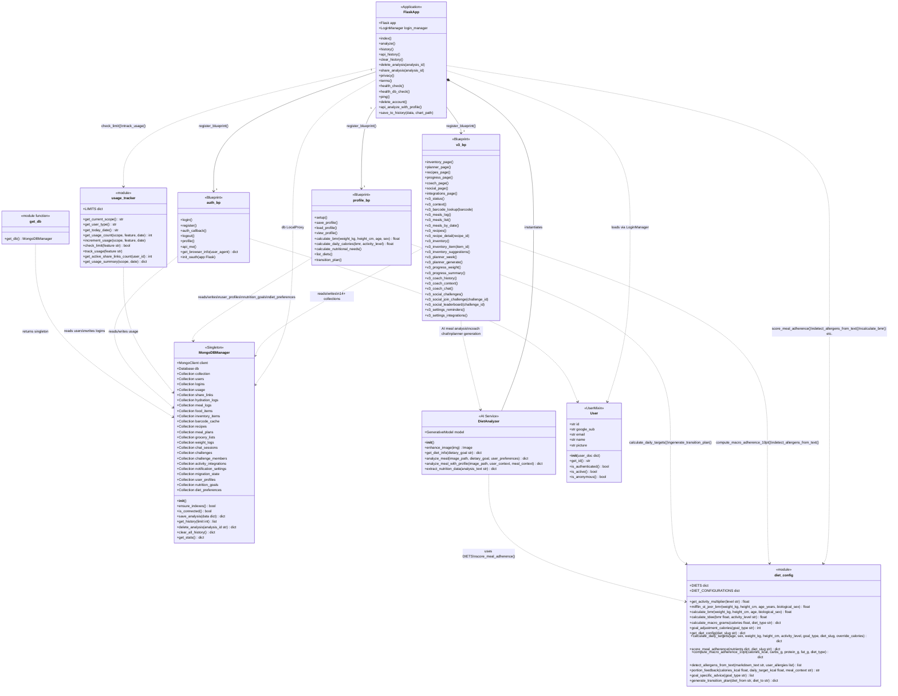

# Alimento — Class Diagram

```mermaid
classDiagram

    %% ─────────────────────────────────────────
    %% PERSISTENCE LAYER
    %% ─────────────────────────────────────────

    class MongoDBManager {
        <<Singleton>>
        +MongoClient client
        +Database db
        +Collection collection
        +Collection users
        +Collection logins
        +Collection usage
        +Collection share_links
        +Collection hydration_logs
        +Collection meal_logs
        +Collection food_items
        +Collection inventory_items
        +Collection barcode_cache
        +Collection recipes
        +Collection meal_plans
        +Collection grocery_lists
        +Collection weight_logs
        +Collection chat_sessions
        +Collection challenges
        +Collection challenge_members
        +Collection activity_integrations
        +Collection notification_settings
        +Collection migration_state
        +Collection user_profiles
        +Collection nutrition_goals
        +Collection diet_preferences
        +__init__()
        +ensure_indexes() bool
        +is_connected() bool
        +save_analysis(data dict) dict
        +get_history(limit int) list
        +delete_analysis(analysis_id str) dict
        +clear_all_history() dict
        +get_stats() dict
    }

    class get_db {
        <<module function>>
        +get_db() MongoDBManager
    }

    get_db ..> MongoDBManager : returns singleton

    %% ─────────────────────────────────────────
    %% DOMAIN / LOGIC LAYER
    %% ─────────────────────────────────────────

    class diet_config {
        <<module>>
        +DIETS dict
        +DIET_CONFIGURATIONS dict
        +get_activity_multiplier(level str) float
        +mifflin_st_jeor_bmr(weight_kg, height_cm, age_years, biological_sex) float
        +calculate_bmr(weight_kg, height_cm, age, biological_sex) float
        +calculate_tdee(bmr float, activity_level str) float
        +calculate_macro_grams(calories float, diet_type str) dict
        +goal_adjustment_calories(goal_type str) int
        +get_diet_config(diet_slug str) dict
        +calculate_daily_targets(age, sex, weight_kg, height_cm, activity_level, goal_type, diet_slug, override_calories) dict
        +score_meal_adherence(nutrients dict, diet_slug str) dict
        +compute_macro_adherence_10pt(calories_kcal, carbs_g, protein_g, fat_g, diet_type) dict
        +detect_allergens_from_text(markdown_text str, user_allergies list) list
        +portion_feedback(calories_kcal float, daily_target_kcal float, meal_context str) str
        +goal_specific_advice(goal_type str) list
        +generate_transition_plan(diet_from str, diet_to str) dict
    }

    class DietAnalyzer {
        <<AI Service>>
        +GenerativeModel model
        +__init__()
        +enhance_image(img) Image
        +get_diet_info(dietary_goal str) dict
        +analyze_meal(image_path, dietary_goal, user_preferences) dict
        +analyze_meal_with_profile(image_path, user_context, meal_context) dict
        +extract_nutrition_data(analysis_text str) dict
    }

    DietAnalyzer ..> diet_config : uses DIETS\nscore_meal_adherence()

    %% ─────────────────────────────────────────
    %% AUTH / SESSION LAYER
    %% ─────────────────────────────────────────

    class User {
        <<UserMixin>>
        +str id
        +str google_sub
        +str email
        +str name
        +str picture
        +__init__(user_doc dict)
        +get_id() str
        +is_authenticated() bool
        +is_active() bool
        +is_anonymous() bool
    }

    class auth_bp {
        <<Blueprint>>
        +login()
        +register()
        +auth_callback()
        +logout()
        +profile()
        +api_me()
        +get_browser_info(user_agent) dict
        +init_oauth(app Flask)
    }

    class usage_tracker {
        <<module>>
        +LIMITS dict
        +get_current_scope() str
        +get_user_type() str
        +get_today_date() str
        +get_usage_count(scope, feature, date) int
        +increment_usage(scope, feature, date)
        +check_limit(feature str) bool
        +track_usage(feature str)
        +get_active_share_links_count(user_id) int
        +get_usage_summary(scope, date) dict
    }

    auth_bp ..> User : creates / loads
    auth_bp ..> MongoDBManager : reads users\nwrites logins
    usage_tracker ..> MongoDBManager : reads/writes usage

    %% ─────────────────────────────────────────
    %% PROFILE BLUEPRINT
    %% ─────────────────────────────────────────

    class profile_bp {
        <<Blueprint>>
        +setup()
        +save_profile()
        +load_profile()
        +view_profile()
        +calculate_bmr(weight_kg, height_cm, age, sex) float
        +calculate_daily_calories(bmr, activity_level) float
        +calculate_nutritional_needs()
        +list_diets()
        +transition_plan()
    }

    profile_bp ..> diet_config : calculate_daily_targets()\ngenerate_transition_plan()
    profile_bp ..> MongoDBManager : reads/writes\nuser_profiles\nnutrition_goals\ndiet_preferences

    %% ─────────────────────────────────────────
    %% V3 FEATURES BLUEPRINT
    %% ─────────────────────────────────────────

    class v3_bp {
        <<Blueprint>>
        +inventory_page()
        +planner_page()
        +recipes_page()
        +progress_page()
        +coach_page()
        +social_page()
        +integrations_page()
        +v3_status()
        +v3_context()
        +v3_barcode_lookup(barcode)
        +v3_meals_log()
        +v3_meals_list()
        +v3_meals_by_date()
        +v3_recipes()
        +v3_recipe_detail(recipe_id)
        +v3_inventory()
        +v3_inventory_item(item_id)
        +v3_inventory_suggestions()
        +v3_planner_week()
        +v3_planner_generate()
        +v3_progress_weight()
        +v3_progress_summary()
        +v3_coach_history()
        +v3_coach_context()
        +v3_coach_chat()
        +v3_social_challenges()
        +v3_social_join_challenge(challenge_id)
        +v3_social_leaderboard(challenge_id)
        +v3_settings_reminders()
        +v3_settings_integrations()
    }

    v3_bp ..> MongoDBManager : reads/writes\n14+ collections
    v3_bp ..> diet_config : compute_macro_adherence_10pt()\ndetect_allergens_from_text()
    v3_bp ..> DietAnalyzer : AI meal analysis\ncoach chat\nplanner generation

    %% ─────────────────────────────────────────
    %% CORE APPLICATION
    %% ─────────────────────────────────────────

    class FlaskApp {
        <<Application>>
        +Flask app
        +LoginManager login_manager
        +index()
        +analyze()
        +history()
        +api_history()
        +clear_history()
        +delete_analysis(analysis_id)
        +share_analysis(analysis_id)
        +privacy()
        +terms()
        +health_check()
        +health_db_check()
        +ping()
        +delete_account()
        +api_analyze_with_profile()
        +save_to_history(data, chart_path)
    }

    FlaskApp *-- DietAnalyzer : instantiates
    FlaskApp ..> User : loads via LoginManager
    FlaskApp ..> MongoDBManager : db LocalProxy
    FlaskApp ..> diet_config : score_meal_adherence()\ndetect_allergens_from_text()\ncalculate_bmr() etc.
    FlaskApp ..> usage_tracker : check_limit()\ntrack_usage()

    FlaskApp "1" --> "1" auth_bp : register_blueprint()
    FlaskApp "1" --> "1" profile_bp : register_blueprint()
    FlaskApp "1" --> "1" v3_bp : register_blueprint()
```
